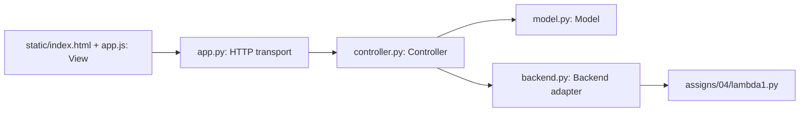

# Architecture

The workbench is a local Model–View–Controller application. The model owns applied source. The view only presents that state and forwards events. The controller is the only module that calls the language adapter.

| Responsibility | Implementation |
| --- | --- |
| Model | `Model.apply`, `Model.begin`, `Model.finish` in `model.py`. Owns name, source, revision, the latest result, the generated artifact, and the busy flag. |
| View | `static/index.html`, `static/style.css`, `static/app.js`. Renders the load menu, editor, five actions, status text, and literal results. It does not parse or evaluate LAMBDA. |
| Controller | `Controller.apply` and `Controller.run` in `controller.py`. Checks unapplied editor text, serializes state changes, calls the adapter, and always clears busy. |
| HTTP transport | `app.py`. Decodes JSON and uploads, serves the page, and turns model errors into HTTP 400. It does not call `d0exp_evaluate`. |
| Language adapter | `read_source`, `perform`, and `Backend.run` in `backend.py`. Validates constructors, then calls `d0exp_fvset` or `d0exp_evaluate`. |

## Load source, then Lint, then Interpret

1. The view loads canned text from `GET /api/examples` or from the editor and posts it to `POST /api/source`.
2. `Controller.apply` calls `Model.apply`. Empty source and source over 65,536 bytes are rejected, and the previous revision stays. An accepted source increments the revision and clears the result and artifact.
3. Lint posts `POST /api/action` with the editor text. If that text differs from the applied source, the controller rejects the call. Otherwise `Model.begin` requires an idle model and an applied revision, then sets busy.
4. The controller releases its lock and calls `Backend.run("lint", source)`. The adapter parses constructors without executing them and calls `d0exp_fvset`. An empty `frozenset` is success. A nonempty set is a language error whose names are sorted. Lint does not call `d0exp_evaluate`, so an undeclared variable is reported here and a closed expression that would fail at runtime still passes.
5. The controller stores `{operation, revision, outcome, text}` and clears busy. The view prints that record as text.
6. Interpret repeats the same path with `d0exp_evaluate(expr, ENVnil())`. It does not require a prior Lint success. `D0V000()` at the top level or inside a pair is a runtime error. `ZeroDivisionError` and `TypeError` are runtime errors. A constructor that does not parse is an input error.

## Backend contract

`Backend.run(operation, source)` returns `{outcome, text}`.

| Outcome | Meaning |
| --- | --- |
| `success` | Lint found no free variables, or Interpret returned a value with no `D0V000`. |
| `input_error` | The text is not one supported constructor expression. |
| `language_error` | Lint found undeclared variables. |
| `runtime_error` | Evaluation raised, or returned `D0V000` directly or inside a pair. |
| `backend_error` | The worker crashed or exceeded the time limit. |
| `not_implemented` | Type-check, Compile, or a direct Execute call. This is not success and produces no artifact. |

The controller attaches `operation` and the source `revision`. A second tool call or `apply` while busy raises, so the revision cannot change during a call. After a backend failure the source is unchanged and busy is false, so the same action can be retried.

Type-check returns “Type checking is not yet implemented.” Compile returns “Compilation is not yet implemented.” Neither stores an artifact. Execute is rejected by `Model.begin` and the button stays disabled. Interpretation is not used as a stand-in for Execute.

A future artifact is `{revision, format, payload, producer_version}`. A real compiler would return that object for the active revision. `Model.apply` already drops `artifact`. `Model.begin("compile")` drops it before the attempt, so a failed recompilation leaves nothing to execute. Execute would receive the stored payload and would not compile again.

## Decisions

The page keeps unapplied text in the browser, and the model stores only applied source. Apply and Discard are then explicit, and the model can be tested without a server. The cost is that a refresh drops the draft, and the server sees unapplied text only when an action includes it. Tool actions send the editor text and are rejected when it does not match.

Language work runs in a child process with a 3-second wall-clock limit. The server can still answer `GET /api/state` while that child runs, and a nonterminating program cannot leave `busy` set. The cost is process startup. This Windows-compatible bound does not apply a POSIX memory cap; the limit is time, plus Python’s own recursion limit.
